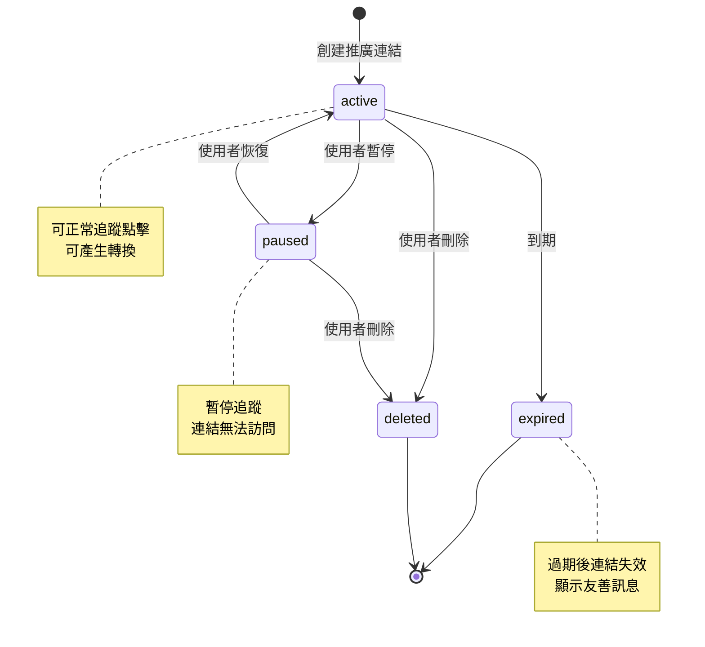
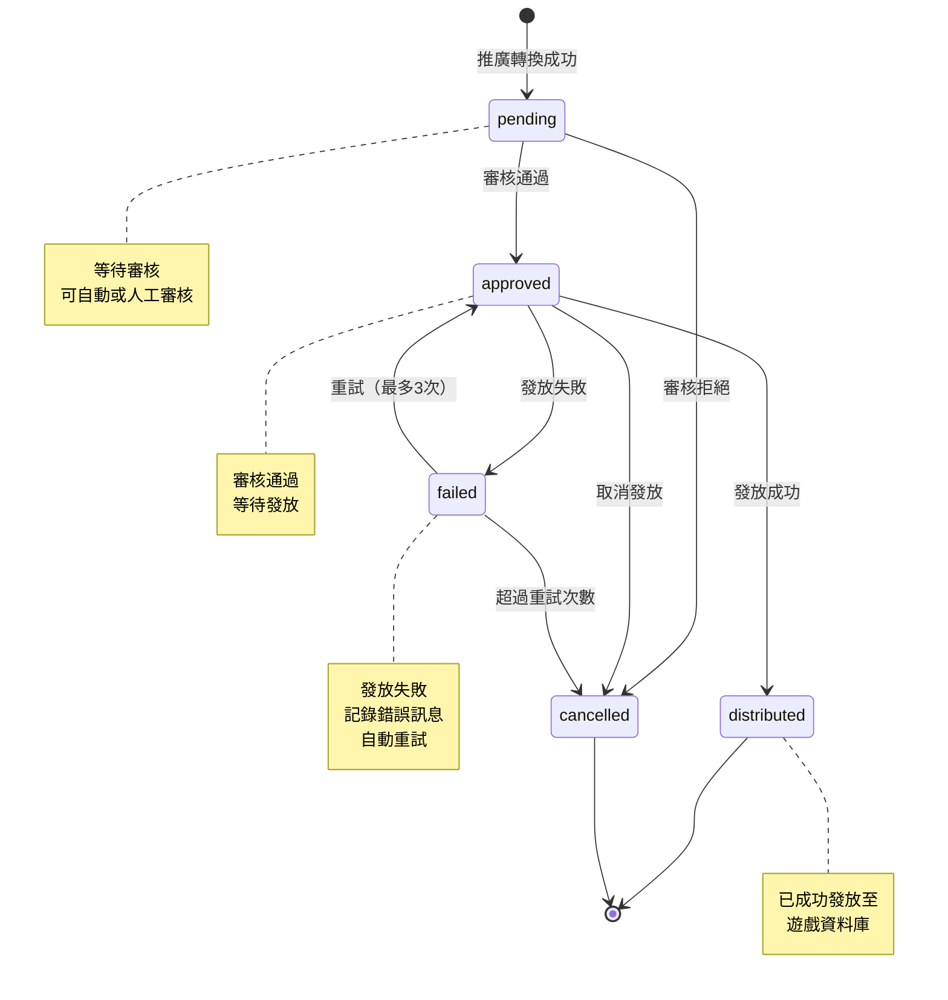
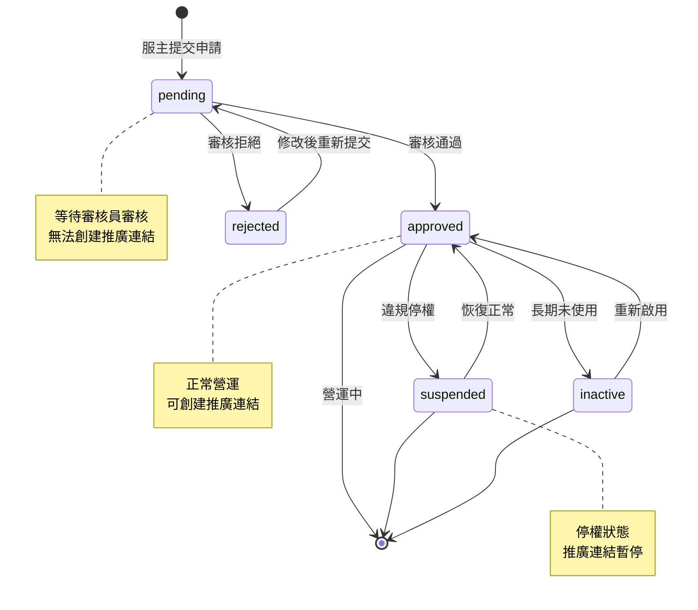

# Data Model Documentation
# 遊戲伺服器推廣平台 - 資料庫架構

**Feature Branch**: `002-view-spekkit`
**Created**: 2025-10-08
**Version**: 1.0
**Status**: Baseline Documentation

---

## 1. Overview

本系統採用關聯式資料庫設計，共包含 **13 個核心資料表**，支援完整的遊戲伺服器推廣平台功能。資料庫架構遵循以下設計原則：

### 設計原則

- **正規化設計**: 達到第三正規化（3NF），避免資料冗餘
- **軟刪除機制**: 核心資料表採用 `deleted_at` 欄位實現軟刪除
- **審計追蹤**: 所有資料表包含 `created_at` 和 `updated_at` 時間戳
- **外鍵約束**: 維護資料完整性和參照完整性
- **索引優化**: 在常用查詢欄位建立索引提升效能

### 資料表分類

#### 認證與權限 (4 tables)
1. `users` - 使用者資料
2. `roles` - 角色定義
3. `permissions` - 權限定義
4. `user_roles` - 使用者-角色關聯 (Junction)
5. `role_permissions` - 角色-權限關聯 (Junction)

#### 伺服器管理 (2 tables)
6. `servers` - 伺服器基本資訊
7. `server_settings` - 伺服器進階設定

#### Session 管理 (1 table)
8. `user_sessions` - 使用者登入 Session

#### 推廣系統 (3 tables)
9. `promotions` - 推廣連結記錄
10. `promotion_stats` - 推廣統計資料
11. `promotion_clicks` - 推廣點擊記錄

#### 獎勵系統 (2 tables)
12. `rewards` - 獎勵記錄
13. `reward_settings` - 獎勵規則設定

---

## 2. Entity Relationship Diagram

```mermaid
erDiagram
    users ||--o{ user_roles : "has"
    users ||--o{ user_sessions : "has"
    users ||--o{ servers : "owns"
    users ||--o{ promotions : "creates"
    users ||--o{ rewards : "receives"

    roles ||--o{ user_roles : "assigned to"
    roles ||--o{ role_permissions : "has"

    permissions ||--o{ role_permissions : "granted to"

    servers ||--o{ server_settings : "has"
    servers ||--o{ promotions : "promoted by"
    servers ||--o{ rewards : "issues"
    servers ||--o{ reward_settings : "defines"

    promotions ||--o{ promotion_stats : "has"
    promotions ||--o{ promotion_clicks : "tracks"
    promotions ||--o{ rewards : "generates"

    reward_settings ||--o{ rewards : "applies to"

    users {
        bigint id PK
        string username UK
        string email UK
        string password_hash
        string full_name
        string phone
        string line_id
        string discord_id
        string avatar_url
        int login_attempts
        datetime locked_until
        datetime last_login_at
        string last_login_ip
        datetime created_at
        datetime updated_at
        datetime deleted_at
    }

    roles {
        int id PK
        string name UK
        string code UK
        int level
        string description
        enum status
        datetime created_at
        datetime updated_at
    }

    permissions {
        int id PK
        string resource
        string action
        string name UK
        string description
        datetime created_at
        datetime updated_at
    }

    user_roles {
        bigint id PK
        bigint user_id FK
        int role_id FK
        bigint assigned_by FK
        datetime valid_from
        datetime valid_until
        datetime created_at
    }

    role_permissions {
        bigint id PK
        int role_id FK
        int permission_id FK
        datetime created_at
    }

    servers {
        bigint id PK
        bigint owner_id FK
        string server_code UK
        string name
        string game_type
        string game_version
        string ip_address
        string port
        int max_players
        text description
        string logo_url
        string banner_url
        string background_url
        string discord_url
        string website_url
        json features_tags
        enum status
        datetime approved_at
        bigint approved_by FK
        text rejection_reason
        boolean is_featured
        datetime featured_until
        datetime created_at
        datetime updated_at
        datetime deleted_at
    }

    server_settings {
        bigint id PK
        bigint server_id FK UK
        string db_host
        string db_name
        string db_username
        string db_password_encrypted
        int db_port
        string reward_table_name
        json reward_field_mapping
        boolean auto_approve_rewards
        enum notification_type
        string notification_email
        string notification_line_token
        json advanced_settings
        datetime created_at
        datetime updated_at
    }

    user_sessions {
        bigint id PK
        bigint user_id FK
        string access_token UK
        string refresh_token UK
        datetime access_token_expires_at
        datetime refresh_token_expires_at
        string ip_address
        string user_agent
        datetime last_activity_at
        datetime created_at
        datetime updated_at
    }

    promotions {
        bigint id PK
        bigint user_id FK
        bigint server_id FK
        string promotion_code UK
        string full_url
        string short_url
        string qr_code_url
        enum status
        datetime expires_at
        int total_clicks
        int unique_clicks
        int conversions
        decimal conversion_rate
        datetime created_at
        datetime updated_at
        datetime deleted_at
    }

    promotion_stats {
        bigint id PK
        bigint promotion_id FK
        date stats_date
        int daily_clicks
        int daily_unique_clicks
        int daily_conversions
        json hourly_distribution
        json source_breakdown
        json device_breakdown
        datetime created_at
        datetime updated_at
    }

    promotion_clicks {
        bigint id PK
        bigint promotion_id FK
        string ip_address
        string user_agent
        string referrer
        string device_type
        string browser
        string os
        string country
        string city
        string fingerprint
        boolean is_unique
        datetime clicked_at
    }

    rewards {
        bigint id PK
        bigint user_id FK
        bigint server_id FK
        bigint promotion_id FK
        bigint reward_setting_id FK
        enum reward_type
        string reward_content
        int reward_quantity
        string game_character_name
        enum status
        int priority
        datetime approved_at
        bigint approved_by FK
        datetime distributed_at
        text distribution_error
        int retry_count
        datetime created_at
        datetime updated_at
        datetime deleted_at
    }

    reward_settings {
        bigint id PK
        bigint server_id FK
        string name
        enum reward_type
        json trigger_conditions
        json reward_config
        json limits_config
        int priority
        boolean is_active
        boolean auto_approve
        boolean auto_distribute
        datetime valid_from
        datetime valid_until
        int usage_count
        int success_count
        int failed_count
        datetime created_at
        datetime updated_at
    }
```

---

## 3. Table Definitions

### 3.1 users - 使用者資料表

**Purpose**: 儲存平台所有使用者的帳號資訊、個人資料、安全設定。

| Field Name | Data Type | Constraints | Default | Description |
|------------|-----------|-------------|---------|-------------|
| `id` | BIGINT UNSIGNED | PRIMARY KEY, AUTO_INCREMENT | - | 使用者唯一識別碼 |
| `username` | VARCHAR(50) | NOT NULL, UNIQUE | - | 使用者名稱（登入用） |
| `email` | VARCHAR(100) | NOT NULL, UNIQUE | - | 電子郵件地址（登入用） |
| `password_hash` | VARCHAR(255) | NOT NULL | - | 密碼雜湊值（bcrypt） |
| `full_name` | VARCHAR(100) | NULL | NULL | 使用者全名 |
| `phone` | VARCHAR(20) | NULL | NULL | 聯絡電話 |
| `line_id` | VARCHAR(50) | NULL | NULL | LINE ID |
| `discord_id` | VARCHAR(100) | NULL | NULL | Discord 使用者 ID |
| `avatar_url` | VARCHAR(255) | NULL | NULL | 使用者頭像 URL |
| `login_attempts` | TINYINT UNSIGNED | NOT NULL | 0 | 登入失敗次數 |
| `locked_until` | DATETIME | NULL | NULL | 帳號鎖定解除時間 |
| `last_login_at` | DATETIME | NULL | NULL | 最後登入時間 |
| `last_login_ip` | VARCHAR(45) | NULL | NULL | 最後登入 IP（支援 IPv6） |
| `created_at` | DATETIME | NOT NULL | CURRENT_TIMESTAMP | 帳號建立時間 |
| `updated_at` | DATETIME | NOT NULL | CURRENT_TIMESTAMP ON UPDATE | 最後更新時間 |
| `deleted_at` | DATETIME | NULL | NULL | 軟刪除時間戳 |

**Indexes**:
- PRIMARY KEY (`id`)
- UNIQUE KEY `uk_username` (`username`)
- UNIQUE KEY `uk_email` (`email`)
- INDEX `idx_email` (`email`)
- INDEX `idx_deleted_at` (`deleted_at`)
- INDEX `idx_last_login_at` (`last_login_at`)

**Example Record**:
```json
{
  "id": 1,
  "username": "server_admin",
  "email": "admin@example.com",
  "password_hash": "$2y$10$92IXUNpkjO0rOQ5byMi.Ye4oKoEa3Ro9llC/.og/at2.uheWG/igi",
  "full_name": "張大明",
  "phone": "+886912345678",
  "line_id": "line_user123",
  "discord_id": "discord_user#1234",
  "avatar_url": "https://example.com/avatars/user1.jpg",
  "login_attempts": 0,
  "locked_until": null,
  "last_login_at": "2025-10-08 10:30:00",
  "last_login_ip": "192.168.1.100",
  "created_at": "2025-01-15 08:00:00",
  "updated_at": "2025-10-08 10:30:00",
  "deleted_at": null
}
```

---

### 3.2 roles - 角色定義表

**Purpose**: 定義系統中的五級角色層級和角色屬性。

| Field Name | Data Type | Constraints | Default | Description |
|------------|-----------|-------------|---------|-------------|
| `id` | INT UNSIGNED | PRIMARY KEY, AUTO_INCREMENT | - | 角色唯一識別碼 |
| `name` | VARCHAR(50) | NOT NULL, UNIQUE | - | 角色名稱 |
| `code` | VARCHAR(50) | NOT NULL, UNIQUE | - | 角色代碼（如 'super_admin'） |
| `level` | TINYINT UNSIGNED | NOT NULL | - | 角色等級（1=最高，5=最低） |
| `description` | TEXT | NULL | NULL | 角色描述 |
| `status` | ENUM('active', 'inactive') | NOT NULL | 'active' | 角色狀態 |
| `created_at` | DATETIME | NOT NULL | CURRENT_TIMESTAMP | 建立時間 |
| `updated_at` | DATETIME | NOT NULL | CURRENT_TIMESTAMP ON UPDATE | 最後更新時間 |

**Indexes**:
- PRIMARY KEY (`id`)
- UNIQUE KEY `uk_name` (`name`)
- UNIQUE KEY `uk_code` (`code`)
- INDEX `idx_level` (`level`)
- INDEX `idx_status` (`status`)

**Example Record**:
```json
{
  "id": 3,
  "name": "Server Owner",
  "code": "server_owner",
  "level": 3,
  "description": "遊戲伺服器擁有者，可管理自己的伺服器設定、查看推廣效果、設定獎勵規則",
  "status": "active",
  "created_at": "2025-01-01 00:00:00",
  "updated_at": "2025-01-01 00:00:00"
}
```

**Predefined Roles**:
| ID | Name | Code | Level | Description |
|----|------|------|-------|-------------|
| 1 | Super Admin | super_admin | 1 | 最高權限管理員 |
| 2 | Admin | admin | 2 | 一般管理員 |
| 3 | Server Owner | server_owner | 3 | 伺服器擁有者 |
| 4 | Reviewer | reviewer | 4 | 審核員 |
| 5 | User | user | 5 | 一般使用者 |

---

### 3.3 permissions - 權限定義表

**Purpose**: 定義系統所有可執行操作的權限，採用資源-動作模型。

| Field Name | Data Type | Constraints | Default | Description |
|------------|-----------|-------------|---------|-------------|
| `id` | INT UNSIGNED | PRIMARY KEY, AUTO_INCREMENT | - | 權限唯一識別碼 |
| `resource` | VARCHAR(50) | NOT NULL | - | 資源名稱（如 'users', 'servers'） |
| `action` | VARCHAR(50) | NOT NULL | - | 動作名稱（如 'create', 'read', 'update', 'delete'） |
| `name` | VARCHAR(100) | NOT NULL, UNIQUE | - | 權限完整名稱（如 'users.create'） |
| `description` | TEXT | NULL | NULL | 權限描述 |
| `created_at` | DATETIME | NOT NULL | CURRENT_TIMESTAMP | 建立時間 |
| `updated_at` | DATETIME | NOT NULL | CURRENT_TIMESTAMP ON UPDATE | 最後更新時間 |

**Indexes**:
- PRIMARY KEY (`id`)
- UNIQUE KEY `uk_name` (`name`)
- INDEX `idx_resource_action` (`resource`, `action`)

**Example Records**:
```json
[
  {
    "id": 1,
    "resource": "users",
    "action": "create",
    "name": "users.create",
    "description": "建立新使用者帳號",
    "created_at": "2025-01-01 00:00:00",
    "updated_at": "2025-01-01 00:00:00"
  },
  {
    "id": 10,
    "resource": "servers",
    "action": "approve",
    "name": "servers.approve",
    "description": "審核伺服器申請",
    "created_at": "2025-01-01 00:00:00",
    "updated_at": "2025-01-01 00:00:00"
  },
  {
    "id": 20,
    "resource": "rewards",
    "action": "approve",
    "name": "rewards.approve",
    "description": "審核獎勵發放",
    "created_at": "2025-01-01 00:00:00",
    "updated_at": "2025-01-01 00:00:00"
  }
]
```

**Permission Categories**:
- **users.*** - 使用者管理權限
- **roles.*** - 角色管理權限
- **permissions.*** - 權限管理權限
- **servers.*** - 伺服器管理權限
- **promotions.*** - 推廣管理權限
- **rewards.*** - 獎勵管理權限
- **settings.*** - 系統設定權限
- **reports.*** - 報表查看權限

---

### 3.4 user_roles - 使用者角色關聯表

**Purpose**: 實現使用者與角色的多對多關聯，支援角色有效期限。

| Field Name | Data Type | Constraints | Default | Description |
|------------|-----------|-------------|---------|-------------|
| `id` | BIGINT UNSIGNED | PRIMARY KEY, AUTO_INCREMENT | - | 關聯唯一識別碼 |
| `user_id` | BIGINT UNSIGNED | NOT NULL, FOREIGN KEY → users(id) | - | 使用者 ID |
| `role_id` | INT UNSIGNED | NOT NULL, FOREIGN KEY → roles(id) | - | 角色 ID |
| `assigned_by` | BIGINT UNSIGNED | NULL, FOREIGN KEY → users(id) | NULL | 分配者使用者 ID |
| `valid_from` | DATETIME | NULL | NULL | 角色生效時間 |
| `valid_until` | DATETIME | NULL | NULL | 角色失效時間 |
| `created_at` | DATETIME | NOT NULL | CURRENT_TIMESTAMP | 分配時間 |

**Indexes**:
- PRIMARY KEY (`id`)
- UNIQUE KEY `uk_user_role` (`user_id`, `role_id`)
- INDEX `idx_user_id` (`user_id`)
- INDEX `idx_role_id` (`role_id`)
- INDEX `idx_valid_period` (`valid_from`, `valid_until`)

**Foreign Keys**:
- `fk_user_roles_user_id` FOREIGN KEY (`user_id`) REFERENCES `users`(`id`) ON DELETE CASCADE
- `fk_user_roles_role_id` FOREIGN KEY (`role_id`) REFERENCES `roles`(`id`) ON DELETE CASCADE
- `fk_user_roles_assigned_by` FOREIGN KEY (`assigned_by`) REFERENCES `users`(`id`) ON DELETE SET NULL

**Example Record**:
```json
{
  "id": 1,
  "user_id": 15,
  "role_id": 3,
  "assigned_by": 1,
  "valid_from": "2025-01-15 00:00:00",
  "valid_until": null,
  "created_at": "2025-01-15 08:30:00"
}
```

---

### 3.5 role_permissions - 角色權限關聯表

**Purpose**: 實現角色與權限的多對多關聯。

| Field Name | Data Type | Constraints | Default | Description |
|------------|-----------|-------------|---------|-------------|
| `id` | BIGINT UNSIGNED | PRIMARY KEY, AUTO_INCREMENT | - | 關聯唯一識別碼 |
| `role_id` | INT UNSIGNED | NOT NULL, FOREIGN KEY → roles(id) | - | 角色 ID |
| `permission_id` | INT UNSIGNED | NOT NULL, FOREIGN KEY → permissions(id) | - | 權限 ID |
| `created_at` | DATETIME | NOT NULL | CURRENT_TIMESTAMP | 授權時間 |

**Indexes**:
- PRIMARY KEY (`id`)
- UNIQUE KEY `uk_role_permission` (`role_id`, `permission_id`)
- INDEX `idx_role_id` (`role_id`)
- INDEX `idx_permission_id` (`permission_id`)

**Foreign Keys**:
- `fk_role_permissions_role_id` FOREIGN KEY (`role_id`) REFERENCES `roles`(`id`) ON DELETE CASCADE
- `fk_role_permissions_permission_id` FOREIGN KEY (`permission_id`) REFERENCES `permissions`(`id`) ON DELETE CASCADE

**Example Record**:
```json
{
  "id": 1,
  "role_id": 3,
  "permission_id": 15,
  "created_at": "2025-01-01 00:00:00"
}
```

---

### 3.6 servers - 伺服器資訊表

**Purpose**: 儲存遊戲伺服器的基本資訊、狀態、視覺素材等。

| Field Name | Data Type | Constraints | Default | Description |
|------------|-----------|-------------|---------|-------------|
| `id` | BIGINT UNSIGNED | PRIMARY KEY, AUTO_INCREMENT | - | 伺服器唯一識別碼 |
| `owner_id` | BIGINT UNSIGNED | NOT NULL, FOREIGN KEY → users(id) | - | 伺服器擁有者 ID |
| `server_code` | VARCHAR(50) | NOT NULL, UNIQUE | - | 伺服器唯一代碼 |
| `name` | VARCHAR(100) | NOT NULL | - | 伺服器名稱 |
| `game_type` | VARCHAR(50) | NOT NULL | - | 遊戲類型（如 'Minecraft', 'ARK'） |
| `game_version` | VARCHAR(50) | NULL | NULL | 遊戲版本 |
| `ip_address` | VARCHAR(100) | NOT NULL | - | 伺服器 IP 地址 |
| `port` | VARCHAR(10) | NULL | NULL | 伺服器端口 |
| `max_players` | INT UNSIGNED | NULL | NULL | 最大玩家數 |
| `description` | TEXT | NULL | NULL | 伺服器描述 |
| `logo_url` | VARCHAR(255) | NULL | NULL | 伺服器 Logo URL |
| `banner_url` | VARCHAR(255) | NULL | NULL | 伺服器 Banner URL |
| `background_url` | VARCHAR(255) | NULL | NULL | 伺服器背景圖 URL |
| `discord_url` | VARCHAR(255) | NULL | NULL | Discord 社群連結 |
| `website_url` | VARCHAR(255) | NULL | NULL | 官方網站連結 |
| `features_tags` | JSON | NULL | NULL | 特色標籤（JSON 陣列） |
| `status` | ENUM('pending', 'approved', 'rejected', 'suspended', 'inactive') | NOT NULL | 'pending' | 伺服器狀態 |
| `approved_at` | DATETIME | NULL | NULL | 審核通過時間 |
| `approved_by` | BIGINT UNSIGNED | NULL, FOREIGN KEY → users(id) | NULL | 審核者 ID |
| `rejection_reason` | TEXT | NULL | NULL | 拒絕原因 |
| `is_featured` | BOOLEAN | NOT NULL | FALSE | 是否為精選伺服器 |
| `featured_until` | DATETIME | NULL | NULL | 精選到期時間 |
| `created_at` | DATETIME | NOT NULL | CURRENT_TIMESTAMP | 建立時間 |
| `updated_at` | DATETIME | NOT NULL | CURRENT_TIMESTAMP ON UPDATE | 最後更新時間 |
| `deleted_at` | DATETIME | NULL | NULL | 軟刪除時間戳 |

**Indexes**:
- PRIMARY KEY (`id`)
- UNIQUE KEY `uk_server_code` (`server_code`)
- INDEX `idx_owner_id` (`owner_id`)
- INDEX `idx_status` (`status`)
- INDEX `idx_game_type` (`game_type`)
- INDEX `idx_is_featured` (`is_featured`, `featured_until`)
- INDEX `idx_deleted_at` (`deleted_at`)

**Foreign Keys**:
- `fk_servers_owner_id` FOREIGN KEY (`owner_id`) REFERENCES `users`(`id`) ON DELETE CASCADE
- `fk_servers_approved_by` FOREIGN KEY (`approved_by`) REFERENCES `users`(`id`) ON DELETE SET NULL

**Example Record**:
```json
{
  "id": 1,
  "owner_id": 15,
  "server_code": "MC-SURVIVAL-001",
  "name": "生存冒險伺服器",
  "game_type": "Minecraft",
  "game_version": "1.20.1",
  "ip_address": "play.example.com",
  "port": "25565",
  "max_players": 100,
  "description": "一個友善的生存伺服器，歡迎新手加入！",
  "logo_url": "https://example.com/servers/1/logo.png",
  "banner_url": "https://example.com/servers/1/banner.jpg",
  "background_url": "https://example.com/servers/1/bg.jpg",
  "discord_url": "https://discord.gg/example",
  "website_url": "https://mc-server.example.com",
  "features_tags": ["PVE", "經濟", "保護系統", "自訂地圖"],
  "status": "approved",
  "approved_at": "2025-01-20 10:00:00",
  "approved_by": 1,
  "rejection_reason": null,
  "is_featured": true,
  "featured_until": "2025-12-31 23:59:59",
  "created_at": "2025-01-15 14:30:00",
  "updated_at": "2025-01-20 10:00:00",
  "deleted_at": null
}
```

---

### 3.7 server_settings - 伺服器設定表

**Purpose**: 儲存伺服器的資料庫連線、獎勵映射、通知設定等進階配置。

| Field Name | Data Type | Constraints | Default | Description |
|------------|-----------|-------------|---------|-------------|
| `id` | BIGINT UNSIGNED | PRIMARY KEY, AUTO_INCREMENT | - | 設定唯一識別碼 |
| `server_id` | BIGINT UNSIGNED | NOT NULL, UNIQUE, FOREIGN KEY → servers(id) | - | 伺服器 ID（一對一關係） |
| `db_host` | VARCHAR(255) | NULL | NULL | 遊戲資料庫主機地址 |
| `db_name` | VARCHAR(100) | NULL | NULL | 遊戲資料庫名稱 |
| `db_username` | VARCHAR(100) | NULL | NULL | 資料庫使用者名稱 |
| `db_password_encrypted` | TEXT | NULL | NULL | 加密的資料庫密碼 |
| `db_port` | INT UNSIGNED | NULL | 3306 | 資料庫端口 |
| `reward_table_name` | VARCHAR(100) | NULL | NULL | 獎勵資料表名稱 |
| `reward_field_mapping` | JSON | NULL | NULL | 獎勵欄位映射配置 |
| `auto_approve_rewards` | BOOLEAN | NOT NULL | FALSE | 是否自動審核獎勵 |
| `notification_type` | ENUM('none', 'email', 'line', 'both') | NOT NULL | 'none' | 通知類型 |
| `notification_email` | VARCHAR(100) | NULL | NULL | 通知 Email 地址 |
| `notification_line_token` | VARCHAR(255) | NULL | NULL | LINE Notify Token |
| `advanced_settings` | JSON | NULL | NULL | 進階設定（JSON） |
| `created_at` | DATETIME | NOT NULL | CURRENT_TIMESTAMP | 建立時間 |
| `updated_at` | DATETIME | NOT NULL | CURRENT_TIMESTAMP ON UPDATE | 最後更新時間 |

**Indexes**:
- PRIMARY KEY (`id`)
- UNIQUE KEY `uk_server_id` (`server_id`)

**Foreign Keys**:
- `fk_server_settings_server_id` FOREIGN KEY (`server_id`) REFERENCES `servers`(`id`) ON DELETE CASCADE

**Example Record**:
```json
{
  "id": 1,
  "server_id": 1,
  "db_host": "game-db.example.com",
  "db_name": "minecraft_server",
  "db_username": "reward_writer",
  "db_password_encrypted": "AES_ENCRYPTED_PASSWORD_STRING",
  "db_port": 3306,
  "reward_table_name": "player_rewards",
  "reward_field_mapping": {
    "player_id": "player_uuid",
    "reward_type": "item_type",
    "reward_quantity": "item_amount",
    "timestamp": "created_at"
  },
  "auto_approve_rewards": true,
  "notification_type": "both",
  "notification_email": "admin@mc-server.example.com",
  "notification_line_token": "LINE_NOTIFY_TOKEN_HERE",
  "advanced_settings": {
    "auto_distribute": true,
    "max_daily_rewards": 50,
    "require_online": false
  },
  "created_at": "2025-01-15 14:30:00",
  "updated_at": "2025-02-01 09:15:00"
}
```

**reward_field_mapping Schema**:
```json
{
  "player_id": "目標資料表的玩家識別欄位名稱",
  "reward_type": "獎勵類型欄位名稱",
  "reward_quantity": "獎勵數量欄位名稱",
  "timestamp": "時間戳欄位名稱",
  "status": "狀態欄位名稱 (可選)"
}
```

---

### 3.8 user_sessions - 使用者 Session 表

**Purpose**: 管理使用者的 JWT Token，實現認證和 Token 刷新機制。

| Field Name | Data Type | Constraints | Default | Description |
|------------|-----------|-------------|---------|-------------|
| `id` | BIGINT UNSIGNED | PRIMARY KEY, AUTO_INCREMENT | - | Session 唯一識別碼 |
| `user_id` | BIGINT UNSIGNED | NOT NULL, FOREIGN KEY → users(id) | - | 使用者 ID |
| `access_token` | VARCHAR(500) | NOT NULL, UNIQUE | - | Access Token（JWT） |
| `refresh_token` | VARCHAR(500) | NOT NULL, UNIQUE | - | Refresh Token（JWT） |
| `access_token_expires_at` | DATETIME | NOT NULL | - | Access Token 過期時間 |
| `refresh_token_expires_at` | DATETIME | NOT NULL | - | Refresh Token 過期時間 |
| `ip_address` | VARCHAR(45) | NULL | NULL | 登入 IP 地址 |
| `user_agent` | TEXT | NULL | NULL | 瀏覽器 User Agent |
| `last_activity_at` | DATETIME | NULL | NULL | 最後活動時間 |
| `created_at` | DATETIME | NOT NULL | CURRENT_TIMESTAMP | Session 建立時間 |
| `updated_at` | DATETIME | NOT NULL | CURRENT_TIMESTAMP ON UPDATE | 最後更新時間 |

**Indexes**:
- PRIMARY KEY (`id`)
- UNIQUE KEY `uk_access_token` (`access_token`)
- UNIQUE KEY `uk_refresh_token` (`refresh_token`)
- INDEX `idx_user_id` (`user_id`)
- INDEX `idx_access_expires` (`access_token_expires_at`)
- INDEX `idx_refresh_expires` (`refresh_token_expires_at`)

**Foreign Keys**:
- `fk_user_sessions_user_id` FOREIGN KEY (`user_id`) REFERENCES `users`(`id`) ON DELETE CASCADE

**Example Record**:
```json
{
  "id": 1,
  "user_id": 15,
  "access_token": "eyJhbGciOiJIUzI1NiIsInR5cCI6IkpXVCJ9...",
  "refresh_token": "eyJhbGciOiJIUzI1NiIsInR5cCI6IkpXVCJ9...",
  "access_token_expires_at": "2025-10-08 11:30:00",
  "refresh_token_expires_at": "2025-10-15 10:30:00",
  "ip_address": "192.168.1.100",
  "user_agent": "Mozilla/5.0 (Windows NT 10.0; Win64; x64) AppleWebKit/537.36...",
  "last_activity_at": "2025-10-08 10:35:00",
  "created_at": "2025-10-08 10:30:00",
  "updated_at": "2025-10-08 10:35:00"
}
```

---

### 3.9 promotions - 推廣連結表

**Purpose**: 儲存使用者創建的推廣連結及其統計資料。

| Field Name | Data Type | Constraints | Default | Description |
|------------|-----------|-------------|---------|-------------|
| `id` | BIGINT UNSIGNED | PRIMARY KEY, AUTO_INCREMENT | - | 推廣唯一識別碼 |
| `user_id` | BIGINT UNSIGNED | NOT NULL, FOREIGN KEY → users(id) | - | 推廣者使用者 ID |
| `server_id` | BIGINT UNSIGNED | NOT NULL, FOREIGN KEY → servers(id) | - | 被推廣的伺服器 ID |
| `promotion_code` | VARCHAR(32) | NOT NULL, UNIQUE | - | 推廣代碼（32 字元） |
| `full_url` | VARCHAR(500) | NOT NULL | - | 完整推廣 URL（含 UTM） |
| `short_url` | VARCHAR(255) | NULL | NULL | 短連結 URL |
| `qr_code_url` | VARCHAR(255) | NULL | NULL | QR Code 圖片 URL |
| `status` | ENUM('active', 'paused', 'expired', 'deleted') | NOT NULL | 'active' | 推廣狀態 |
| `expires_at` | DATETIME | NULL | NULL | 推廣連結過期時間 |
| `total_clicks` | INT UNSIGNED | NOT NULL | 0 | 總點擊數 |
| `unique_clicks` | INT UNSIGNED | NOT NULL | 0 | 唯一點擊數 |
| `conversions` | INT UNSIGNED | NOT NULL | 0 | 轉換數（註冊並登入） |
| `conversion_rate` | DECIMAL(5, 2) | NOT NULL | 0.00 | 轉換率（百分比） |
| `created_at` | DATETIME | NOT NULL | CURRENT_TIMESTAMP | 建立時間 |
| `updated_at` | DATETIME | NOT NULL | CURRENT_TIMESTAMP ON UPDATE | 最後更新時間 |
| `deleted_at` | DATETIME | NULL | NULL | 軟刪除時間戳 |

**Indexes**:
- PRIMARY KEY (`id`)
- UNIQUE KEY `uk_promotion_code` (`promotion_code`)
- UNIQUE KEY `uk_user_server_active` (`user_id`, `server_id`, `status`)
- INDEX `idx_user_id` (`user_id`)
- INDEX `idx_server_id` (`server_id`)
- INDEX `idx_status` (`status`)
- INDEX `idx_deleted_at` (`deleted_at`)

**Foreign Keys**:
- `fk_promotions_user_id` FOREIGN KEY (`user_id`) REFERENCES `users`(`id`) ON DELETE CASCADE
- `fk_promotions_server_id` FOREIGN KEY (`server_id`) REFERENCES `servers`(`id`) ON DELETE CASCADE

**Example Record**:
```json
{
  "id": 1,
  "user_id": 25,
  "server_id": 1,
  "promotion_code": "a1b2c3d4e5f6g7h8i9j0k1l2m3n4o5p6",
  "full_url": "https://platform.example.com/promo/a1b2c3d4?utm_source=user25&utm_medium=referral&utm_campaign=server1",
  "short_url": "https://short.ly/abc123",
  "qr_code_url": "https://example.com/qr/a1b2c3d4.png",
  "status": "active",
  "expires_at": null,
  "total_clicks": 1250,
  "unique_clicks": 850,
  "conversions": 42,
  "conversion_rate": 4.94,
  "created_at": "2025-02-01 10:00:00",
  "updated_at": "2025-10-08 09:00:00",
  "deleted_at": null
}
```

---

### 3.10 promotion_stats - 推廣統計表

**Purpose**: 儲存推廣連結的每日統計資料，用於趨勢分析。

| Field Name | Data Type | Constraints | Default | Description |
|------------|-----------|-------------|---------|-------------|
| `id` | BIGINT UNSIGNED | PRIMARY KEY, AUTO_INCREMENT | - | 統計唯一識別碼 |
| `promotion_id` | BIGINT UNSIGNED | NOT NULL, FOREIGN KEY → promotions(id) | - | 推廣 ID |
| `stats_date` | DATE | NOT NULL | - | 統計日期 |
| `daily_clicks` | INT UNSIGNED | NOT NULL | 0 | 當日總點擊數 |
| `daily_unique_clicks` | INT UNSIGNED | NOT NULL | 0 | 當日唯一點擊數 |
| `daily_conversions` | INT UNSIGNED | NOT NULL | 0 | 當日轉換數 |
| `hourly_distribution` | JSON | NULL | NULL | 每小時點擊分佈 |
| `source_breakdown` | JSON | NULL | NULL | 來源網站分佈 |
| `device_breakdown` | JSON | NULL | NULL | 裝置類型分佈 |
| `created_at` | DATETIME | NOT NULL | CURRENT_TIMESTAMP | 建立時間 |
| `updated_at` | DATETIME | NOT NULL | CURRENT_TIMESTAMP ON UPDATE | 最後更新時間 |

**Indexes**:
- PRIMARY KEY (`id`)
- UNIQUE KEY `uk_promotion_date` (`promotion_id`, `stats_date`)
- INDEX `idx_promotion_id` (`promotion_id`)
- INDEX `idx_stats_date` (`stats_date`)

**Foreign Keys**:
- `fk_promotion_stats_promotion_id` FOREIGN KEY (`promotion_id`) REFERENCES `promotions`(`id`) ON DELETE CASCADE

**Example Record**:
```json
{
  "id": 1,
  "promotion_id": 1,
  "stats_date": "2025-10-08",
  "daily_clicks": 85,
  "daily_unique_clicks": 62,
  "daily_conversions": 3,
  "hourly_distribution": {
    "00": 2, "01": 1, "02": 0, "03": 1, "04": 0, "05": 0,
    "06": 3, "07": 5, "08": 8, "09": 12, "10": 10, "11": 9,
    "12": 6, "13": 5, "14": 7, "15": 4, "16": 3, "17": 2,
    "18": 1, "19": 2, "20": 1, "21": 1, "22": 1, "23": 1
  },
  "source_breakdown": {
    "direct": 45,
    "facebook.com": 20,
    "discord.com": 15,
    "google.com": 5
  },
  "device_breakdown": {
    "desktop": 50,
    "mobile": 30,
    "tablet": 5
  },
  "created_at": "2025-10-08 00:00:00",
  "updated_at": "2025-10-08 23:59:59"
}
```

---

### 3.11 promotion_clicks - 推廣點擊記錄表

**Purpose**: 記錄每次推廣連結點擊的詳細資訊，用於防刷和分析。

| Field Name | Data Type | Constraints | Default | Description |
|------------|-----------|-------------|---------|-------------|
| `id` | BIGINT UNSIGNED | PRIMARY KEY, AUTO_INCREMENT | - | 點擊唯一識別碼 |
| `promotion_id` | BIGINT UNSIGNED | NOT NULL, FOREIGN KEY → promotions(id) | - | 推廣 ID |
| `ip_address` | VARCHAR(45) | NOT NULL | - | 訪客 IP 地址 |
| `user_agent` | TEXT | NULL | NULL | 瀏覽器 User Agent |
| `referrer` | VARCHAR(500) | NULL | NULL | 來源網址 |
| `device_type` | VARCHAR(20) | NULL | NULL | 裝置類型（desktop/mobile/tablet） |
| `browser` | VARCHAR(50) | NULL | NULL | 瀏覽器名稱 |
| `os` | VARCHAR(50) | NULL | NULL | 作業系統 |
| `country` | VARCHAR(50) | NULL | NULL | 國家 |
| `city` | VARCHAR(100) | NULL | NULL | 城市 |
| `fingerprint` | VARCHAR(64) | NULL | NULL | 瀏覽器指紋（SHA256） |
| `is_unique` | BOOLEAN | NOT NULL | TRUE | 是否為唯一訪客 |
| `clicked_at` | DATETIME | NOT NULL | CURRENT_TIMESTAMP | 點擊時間 |

**Indexes**:
- PRIMARY KEY (`id`)
- INDEX `idx_promotion_id` (`promotion_id`)
- INDEX `idx_ip_fingerprint` (`ip_address`, `fingerprint`)
- INDEX `idx_clicked_at` (`clicked_at`)
- INDEX `idx_is_unique` (`is_unique`)

**Foreign Keys**:
- `fk_promotion_clicks_promotion_id` FOREIGN KEY (`promotion_id`) REFERENCES `promotions`(`id`) ON DELETE CASCADE

**Example Record**:
```json
{
  "id": 1,
  "promotion_id": 1,
  "ip_address": "203.145.67.89",
  "user_agent": "Mozilla/5.0 (Windows NT 10.0; Win64; x64) AppleWebKit/537.36 (KHTML, like Gecko) Chrome/119.0.0.0 Safari/537.36",
  "referrer": "https://facebook.com/groups/minecraft-tw",
  "device_type": "desktop",
  "browser": "Chrome",
  "os": "Windows 10",
  "country": "Taiwan",
  "city": "Taipei",
  "fingerprint": "8f3e4d5c6b7a8f9e0d1c2b3a4f5e6d7c8b9a0f1e2d3c4b5a6f7e8d9c0b1a2f3e",
  "is_unique": true,
  "clicked_at": "2025-10-08 14:35:22"
}
```

**Unique Visitor Logic**:
唯一訪客判斷邏輯：
- 計算 `fingerprint = SHA256(ip_address + user_agent + browser_features)`
- 查詢過去 24 小時內是否有相同 `fingerprint` 的點擊記錄
- 如果有則 `is_unique = FALSE`，否則 `is_unique = TRUE`

---

### 3.12 rewards - 獎勵記錄表

**Purpose**: 儲存所有獎勵記錄，包含推廣獎勵、活動獎勵等。

| Field Name | Data Type | Constraints | Default | Description |
|------------|-----------|-------------|---------|-------------|
| `id` | BIGINT UNSIGNED | PRIMARY KEY, AUTO_INCREMENT | - | 獎勵唯一識別碼 |
| `user_id` | BIGINT UNSIGNED | NOT NULL, FOREIGN KEY → users(id) | - | 獲獎使用者 ID |
| `server_id` | BIGINT UNSIGNED | NOT NULL, FOREIGN KEY → servers(id) | - | 發放獎勵的伺服器 ID |
| `promotion_id` | BIGINT UNSIGNED | NULL, FOREIGN KEY → promotions(id) | NULL | 相關推廣 ID（推廣獎勵專用） |
| `reward_setting_id` | BIGINT UNSIGNED | NULL, FOREIGN KEY → reward_settings(id) | NULL | 適用的獎勵規則 ID |
| `reward_type` | ENUM('promotion', 'activity', 'checkin', 'referral', 'bonus') | NOT NULL | - | 獎勵類型 |
| `reward_content` | VARCHAR(255) | NOT NULL | - | 獎勵內容描述 |
| `reward_quantity` | INT UNSIGNED | NOT NULL | 1 | 獎勵數量 |
| `game_character_name` | VARCHAR(100) | NULL | NULL | 遊戲角色名稱 |
| `status` | ENUM('pending', 'approved', 'distributed', 'cancelled', 'failed') | NOT NULL | 'pending' | 獎勵狀態 |
| `priority` | TINYINT UNSIGNED | NOT NULL | 5 | 發放優先級（1=最高，10=最低） |
| `approved_at` | DATETIME | NULL | NULL | 審核通過時間 |
| `approved_by` | BIGINT UNSIGNED | NULL, FOREIGN KEY → users(id) | NULL | 審核者 ID |
| `distributed_at` | DATETIME | NULL | NULL | 實際發放時間 |
| `distribution_error` | TEXT | NULL | NULL | 發放錯誤訊息 |
| `retry_count` | TINYINT UNSIGNED | NOT NULL | 0 | 重試次數 |
| `created_at` | DATETIME | NOT NULL | CURRENT_TIMESTAMP | 建立時間 |
| `updated_at` | DATETIME | NOT NULL | CURRENT_TIMESTAMP ON UPDATE | 最後更新時間 |
| `deleted_at` | DATETIME | NULL | NULL | 軟刪除時間戳 |

**Indexes**:
- PRIMARY KEY (`id`)
- INDEX `idx_user_id` (`user_id`)
- INDEX `idx_server_id` (`server_id`)
- INDEX `idx_promotion_id` (`promotion_id`)
- INDEX `idx_reward_setting_id` (`reward_setting_id`)
- INDEX `idx_status` (`status`)
- INDEX `idx_reward_type` (`reward_type`)
- INDEX `idx_priority` (`priority`)
- INDEX `idx_created_at` (`created_at`)
- INDEX `idx_deleted_at` (`deleted_at`)

**Foreign Keys**:
- `fk_rewards_user_id` FOREIGN KEY (`user_id`) REFERENCES `users`(`id`) ON DELETE CASCADE
- `fk_rewards_server_id` FOREIGN KEY (`server_id`) REFERENCES `servers`(`id`) ON DELETE CASCADE
- `fk_rewards_promotion_id` FOREIGN KEY (`promotion_id`) REFERENCES `promotions`(`id`) ON DELETE SET NULL
- `fk_rewards_reward_setting_id` FOREIGN KEY (`reward_setting_id`) REFERENCES `reward_settings`(`id`) ON DELETE SET NULL
- `fk_rewards_approved_by` FOREIGN KEY (`approved_by`) REFERENCES `users`(`id`) ON DELETE SET NULL

**Example Record**:
```json
{
  "id": 1,
  "user_id": 25,
  "server_id": 1,
  "promotion_id": 1,
  "reward_setting_id": 1,
  "reward_type": "promotion",
  "reward_content": "鑽石 x 10",
  "reward_quantity": 10,
  "game_character_name": "Steve123",
  "status": "distributed",
  "priority": 3,
  "approved_at": "2025-10-08 10:05:00",
  "approved_by": 15,
  "distributed_at": "2025-10-08 10:07:30",
  "distribution_error": null,
  "retry_count": 0,
  "created_at": "2025-10-08 10:00:00",
  "updated_at": "2025-10-08 10:07:30",
  "deleted_at": null
}
```

---

### 3.13 reward_settings - 獎勵規則設定表

**Purpose**: 定義伺服器的獎勵發放規則、觸發條件、限制等。

| Field Name | Data Type | Constraints | Default | Description |
|------------|-----------|-------------|---------|-------------|
| `id` | BIGINT UNSIGNED | PRIMARY KEY, AUTO_INCREMENT | - | 規則唯一識別碼 |
| `server_id` | BIGINT UNSIGNED | NOT NULL, FOREIGN KEY → servers(id) | - | 伺服器 ID |
| `name` | VARCHAR(100) | NOT NULL | - | 規則名稱 |
| `reward_type` | ENUM('promotion', 'activity', 'checkin', 'referral', 'bonus') | NOT NULL | - | 獎勵類型 |
| `trigger_conditions` | JSON | NOT NULL | - | 觸發條件（JSON） |
| `reward_config` | JSON | NOT NULL | - | 獎勵配置（JSON） |
| `limits_config` | JSON | NULL | NULL | 限制配置（每日/週/月上限） |
| `priority` | TINYINT UNSIGNED | NOT NULL | 5 | 規則優先級（1=最高，10=最低） |
| `is_active` | BOOLEAN | NOT NULL | TRUE | 是否啟用 |
| `auto_approve` | BOOLEAN | NOT NULL | FALSE | 是否自動審核 |
| `auto_distribute` | BOOLEAN | NOT NULL | FALSE | 是否自動發放 |
| `valid_from` | DATETIME | NULL | NULL | 規則生效時間 |
| `valid_until` | DATETIME | NULL | NULL | 規則失效時間 |
| `usage_count` | INT UNSIGNED | NOT NULL | 0 | 使用次數 |
| `success_count` | INT UNSIGNED | NOT NULL | 0 | 成功發放次數 |
| `failed_count` | INT UNSIGNED | NOT NULL | 0 | 失敗次數 |
| `created_at` | DATETIME | NOT NULL | CURRENT_TIMESTAMP | 建立時間 |
| `updated_at` | DATETIME | NOT NULL | CURRENT_TIMESTAMP ON UPDATE | 最後更新時間 |

**Indexes**:
- PRIMARY KEY (`id`)
- INDEX `idx_server_id` (`server_id`)
- INDEX `idx_reward_type` (`reward_type`)
- INDEX `idx_is_active` (`is_active`)
- INDEX `idx_priority` (`priority`)
- INDEX `idx_valid_period` (`valid_from`, `valid_until`)

**Foreign Keys**:
- `fk_reward_settings_server_id` FOREIGN KEY (`server_id`) REFERENCES `servers`(`id`) ON DELETE CASCADE

**Example Record**:
```json
{
  "id": 1,
  "server_id": 1,
  "name": "首次推廣成功獎勵",
  "reward_type": "promotion",
  "trigger_conditions": {
    "event": "promotion_conversion",
    "first_time_only": true,
    "min_level": null
  },
  "reward_config": {
    "items": [
      {"type": "diamond", "quantity": 10},
      {"type": "gold_ingot", "quantity": 50}
    ],
    "message": "感謝您推廣我們的伺服器！"
  },
  "limits_config": {
    "daily_limit": 3,
    "weekly_limit": 10,
    "monthly_limit": 30,
    "total_limit": null
  },
  "priority": 3,
  "is_active": true,
  "auto_approve": true,
  "auto_distribute": true,
  "valid_from": "2025-01-01 00:00:00",
  "valid_until": "2025-12-31 23:59:59",
  "usage_count": 235,
  "success_count": 230,
  "failed_count": 5,
  "created_at": "2025-01-01 00:00:00",
  "updated_at": "2025-10-08 10:00:00"
}
```

**JSON Schema Examples**:

**trigger_conditions**:
```json
{
  "event": "promotion_conversion",
  "first_time_only": true,
  "min_level": 5,
  "required_tags": ["VIP", "Premium"]
}
```

**reward_config**:
```json
{
  "items": [
    {"type": "diamond", "quantity": 10},
    {"type": "experience", "quantity": 1000}
  ],
  "currency": {"type": "gold", "amount": 500},
  "message": "恭喜獲得推廣獎勵！"
}
```

**limits_config**:
```json
{
  "daily_limit": 3,
  "weekly_limit": 10,
  "monthly_limit": 30,
  "total_limit": 100,
  "cooldown_hours": 24
}
```

---

## 4. State Machine Diagrams

### 4.1 Promotion Status Flow



**State Descriptions**:
- **active**: 推廣連結正常運作，可追蹤點擊和轉換
- **paused**: 使用者主動暫停，連結暫時失效
- **expired**: 達到設定的過期時間，自動失效
- **deleted**: 使用者刪除（軟刪除），不可恢復

### 4.2 Reward Status Flow



**State Descriptions**:
- **pending**: 獎勵已創建，等待審核（人工或自動）
- **approved**: 審核通過，等待系統發放到遊戲資料庫
- **distributed**: 已成功寫入遊戲資料庫，獎勵完成
- **cancelled**: 審核拒絕或手動取消，不會發放
- **failed**: 發放失敗（資料庫連線錯誤等），可重試

**Transition Rules**:
1. `pending → approved`: 需要 `rewards.approve` 權限，或 `auto_approve = true`
2. `approved → distributed`: 自動執行（定時任務），或手動觸發
3. `failed → approved`: 最多重試 3 次，`retry_count < 3`
4. `approved → cancelled`: 需要管理員權限
5. `distributed → *`: 已發放獎勵不可取消或修改

### 4.3 Server Status Flow



---

## 5. Data Integrity Rules

### 5.1 Referential Integrity

**Foreign Key Cascade Rules**:

| Parent Table | Child Table | ON DELETE | ON UPDATE | Reason |
|--------------|-------------|-----------|-----------|--------|
| users | user_roles | CASCADE | CASCADE | 使用者刪除時移除所有角色關聯 |
| users | user_sessions | CASCADE | CASCADE | 使用者刪除時清除所有 Session |
| users | servers | CASCADE | RESTRICT | 使用者刪除時移除其擁有的伺服器 |
| users | promotions | CASCADE | CASCADE | 使用者刪除時移除其推廣連結 |
| users | rewards | CASCADE | CASCADE | 使用者刪除時移除其獎勵記錄 |
| roles | user_roles | CASCADE | CASCADE | 角色刪除時移除所有關聯 |
| servers | server_settings | CASCADE | CASCADE | 伺服器刪除時移除設定 |
| servers | promotions | CASCADE | CASCADE | 伺服器刪除時移除推廣連結 |
| promotions | promotion_clicks | CASCADE | CASCADE | 推廣刪除時移除點擊記錄 |
| promotions | rewards | SET NULL | CASCADE | 推廣刪除時保留獎勵記錄 |

### 5.2 Business Logic Constraints

**Unique Constraints**:
1. **使用者**: `username` 和 `email` 必須全平台唯一
2. **伺服器**: `server_code` 必須全平台唯一
3. **推廣連結**: `promotion_code` 必須全平台唯一
4. **活躍推廣**: 每個使用者對每個伺服器只能有一個 `status='active'` 的推廣
5. **角色**: `code` 和 `name` 必須唯一

**Check Constraints**:
1. **角色等級**: `roles.level` 必須在 1-10 之間
2. **獎勵優先級**: `rewards.priority` 必須在 1-10 之間
3. **獎勵數量**: `rewards.reward_quantity` 必須大於 0
4. **轉換率**: `promotions.conversion_rate` 必須在 0-100 之間
5. **重試次數**: `rewards.retry_count` 必須 <= 3

**Application-Level Validations**:
1. **登入失敗次數**: `users.login_attempts` 達到 5 次後鎖定帳號
2. **Token 過期驗證**: 每次 API 請求驗證 Token 是否過期
3. **權限驗證**: 每次操作驗證使用者是否擁有對應權限
4. **獎勵限制**: 發放前檢查是否超過每日/週/月限制

### 5.3 Soft Delete Policy

**採用軟刪除的資料表**:
- `users`
- `servers`
- `promotions`
- `rewards`

**軟刪除實作**:
- 所有查詢預設加上 `WHERE deleted_at IS NULL`
- 刪除操作執行 `UPDATE table SET deleted_at = NOW() WHERE id = ?`
- 提供管理員介面查看已刪除資料
- 定期清理超過 1 年的軟刪除記錄（除了 rewards）

**不使用軟刪除的資料表**:
- Junction tables (`user_roles`, `role_permissions`)
- Log tables (`promotion_clicks`, `user_sessions`)
- Statistics tables (`promotion_stats`)

---

## 6. Performance Optimization

### 6.1 Index Strategy

**Primary Indexes** (已在各表定義中列出):
- 所有主鍵自動建立 PRIMARY KEY index
- 所有外鍵建立 INDEX
- UNIQUE 約束自動建立 UNIQUE INDEX

**Composite Indexes** (複合索引):
```sql
-- 推廣連結查詢優化
CREATE INDEX idx_user_server_status ON promotions(user_id, server_id, status);

-- 獎勵狀態查詢優化
CREATE INDEX idx_server_status_priority ON rewards(server_id, status, priority);

-- 推廣統計查詢優化
CREATE INDEX idx_promotion_date_range ON promotion_stats(promotion_id, stats_date);

-- 點擊記錄去重優化
CREATE INDEX idx_promo_fingerprint_time ON promotion_clicks(promotion_id, fingerprint, clicked_at);

-- 使用者角色有效期查詢
CREATE INDEX idx_user_role_valid ON user_roles(user_id, valid_from, valid_until);
```

**Full-Text Indexes** (全文檢索):
```sql
-- 伺服器搜尋優化
CREATE FULLTEXT INDEX ft_server_search ON servers(name, description);

-- 使用者搜尋優化
CREATE FULLTEXT INDEX ft_user_search ON users(username, full_name, email);
```

### 6.2 Query Optimization Tips

**常用查詢優化**:

1. **使用者權限檢查**（最頻繁）:
```sql
-- 優化前（N+1 查詢）
SELECT * FROM users WHERE id = ?
SELECT * FROM user_roles WHERE user_id = ?
SELECT * FROM roles WHERE id IN (...)
SELECT * FROM role_permissions WHERE role_id IN (...)
SELECT * FROM permissions WHERE id IN (...)

-- 優化後（一次查詢）
SELECT DISTINCT p.*
FROM users u
JOIN user_roles ur ON u.id = ur.user_id
JOIN roles r ON ur.role_id = r.id
JOIN role_permissions rp ON r.id = rp.role_id
JOIN permissions p ON rp.permission_id = p.id
WHERE u.id = ?
  AND (ur.valid_from IS NULL OR ur.valid_from <= NOW())
  AND (ur.valid_until IS NULL OR ur.valid_until >= NOW())
  AND r.status = 'active';
```

2. **推廣效能排行榜**:
```sql
-- 使用覆蓋索引避免回表
SELECT user_id, server_id, conversions, conversion_rate
FROM promotions
WHERE status = 'active' AND deleted_at IS NULL
ORDER BY conversions DESC, conversion_rate DESC
LIMIT 100;
```

3. **獎勵發放佇列**:
```sql
-- 使用索引掃描 + 分頁
SELECT *
FROM rewards
WHERE status = 'approved' AND deleted_at IS NULL
ORDER BY priority ASC, created_at ASC
LIMIT 100;
```

### 6.3 Caching Strategy

**推薦快取方案**（需要整合 Redis）:

| Data Type | Cache Key Pattern | TTL | Invalidation Trigger |
|-----------|-------------------|-----|---------------------|
| 使用者權限 | `user:permissions:{user_id}` | 1 hour | 角色變更時 |
| 伺服器詳情 | `server:detail:{server_id}` | 10 min | 伺服器更新時 |
| 推廣統計 | `promotion:stats:{promotion_id}` | 5 min | 點擊/轉換時 |
| 排行榜 | `leaderboard:promotions` | 1 hour | 定時重算 |
| Session Token | `session:{access_token}` | 1 hour | 登出時 |

**Cache-Aside Pattern**:
```php
// 範例：取得使用者權限
function getUserPermissions($userId) {
    $cacheKey = "user:permissions:{$userId}";

    // 1. 先查快取
    $cached = Redis::get($cacheKey);
    if ($cached !== null) {
        return json_decode($cached, true);
    }

    // 2. 快取未命中，查詢資料庫
    $permissions = DB::query(/* ... */);

    // 3. 寫入快取
    Redis::setex($cacheKey, 3600, json_encode($permissions));

    return $permissions;
}
```

### 6.4 Database Partitioning

**推薦分區策略**（當資料量達到千萬級時）:

**promotion_clicks 表（按時間分區）**:
```sql
-- 按月分區，保留最近 12 個月資料
ALTER TABLE promotion_clicks
PARTITION BY RANGE (TO_DAYS(clicked_at)) (
    PARTITION p202501 VALUES LESS THAN (TO_DAYS('2025-02-01')),
    PARTITION p202502 VALUES LESS THAN (TO_DAYS('2025-03-01')),
    PARTITION p202503 VALUES LESS THAN (TO_DAYS('2025-04-01')),
    -- ...
    PARTITION pmax VALUES LESS THAN MAXVALUE
);
```

**promotion_stats 表（按日期分區）**:
```sql
-- 按年分區
ALTER TABLE promotion_stats
PARTITION BY RANGE (YEAR(stats_date)) (
    PARTITION p2025 VALUES LESS THAN (2026),
    PARTITION p2026 VALUES LESS THAN (2027),
    PARTITION pmax VALUES LESS THAN MAXVALUE
);
```

---

## 7. Data Migration & Versioning

### 7.1 Schema Version Control

**Migration File Naming Convention**:
```
migrations/
├── 001_create_users_table.sql
├── 002_create_roles_and_permissions.sql
├── 003_create_servers_table.sql
├── 004_create_promotions_tables.sql
├── 005_create_rewards_tables.sql
└── 006_add_featured_servers.sql
```

### 7.2 Seed Data Requirements

**必要的初始資料**:

1. **Roles** (5 個預設角色)
2. **Permissions** (約 50 個基礎權限)
3. **Role-Permission Mappings** (角色權限關聯)
4. **Admin User** (至少一個超級管理員帳號)

**Seed SQL 範例**:
```sql
-- 創建預設角色
INSERT INTO roles (id, name, code, level, description, status) VALUES
(1, 'Super Admin', 'super_admin', 1, '最高權限管理員', 'active'),
(2, 'Admin', 'admin', 2, '一般管理員', 'active'),
(3, 'Server Owner', 'server_owner', 3, '伺服器擁有者', 'active'),
(4, 'Reviewer', 'reviewer', 4, '審核員', 'active'),
(5, 'User', 'user', 5, '一般使用者', 'active');

-- 創建基礎權限
INSERT INTO permissions (resource, action, name, description) VALUES
('users', 'create', 'users.create', '建立使用者'),
('users', 'read', 'users.read', '查看使用者'),
('users', 'update', 'users.update', '更新使用者'),
('users', 'delete', 'users.delete', '刪除使用者'),
-- ... more permissions
;

-- 分配權限給 Super Admin
INSERT INTO role_permissions (role_id, permission_id)
SELECT 1, id FROM permissions; -- Super Admin 擁有所有權限
```

---

## 8. Security Considerations

### 8.1 Sensitive Data Protection

**加密欄位**:
- `users.password_hash` - 使用 bcrypt 雜湊（不可逆）
- `server_settings.db_password_encrypted` - 使用 AES-256 加密（可逆）
- `user_sessions.access_token` - JWT 簽名驗證
- `user_sessions.refresh_token` - JWT 簽名驗證

**PII (Personal Identifiable Information)**:
- `users.email`
- `users.phone`
- `users.line_id`
- `users.discord_id`
- `promotion_clicks.ip_address`

**處理原則**:
1. 僅在必要時收集 PII
2. 加密傳輸（HTTPS）
3. 限制存取權限（需 `users.read_sensitive` 權限）
4. 定期清理過期資料
5. 遵守 GDPR/個資法規定

### 8.2 SQL Injection Prevention

**強制使用 Prepared Statements**:
```php
// ✅ 正確：使用參數綁定
$stmt = $db->prepare("SELECT * FROM users WHERE email = ?");
$stmt->bind_param("s", $email);
$stmt->execute();

// ❌ 錯誤：直接拼接 SQL（嚴禁使用）
$sql = "SELECT * FROM users WHERE email = '$email'";
$result = $db->query($sql);
```

### 8.3 Audit Logging

**需要記錄的操作**:
- 使用者登入/登出
- 角色分配/移除
- 伺服器審核（核准/拒絕）
- 獎勵審核（核准/拒絕）
- 敏感設定變更
- 資料刪除操作

**Audit Log 表結構**（未來擴充）:
```sql
CREATE TABLE audit_logs (
    id BIGINT UNSIGNED PRIMARY KEY AUTO_INCREMENT,
    user_id BIGINT UNSIGNED NOT NULL,
    action VARCHAR(100) NOT NULL,
    resource_type VARCHAR(50) NOT NULL,
    resource_id BIGINT UNSIGNED NULL,
    old_values JSON NULL,
    new_values JSON NULL,
    ip_address VARCHAR(45) NOT NULL,
    user_agent TEXT NULL,
    created_at DATETIME NOT NULL DEFAULT CURRENT_TIMESTAMP,
    INDEX idx_user_id (user_id),
    INDEX idx_action (action),
    INDEX idx_created_at (created_at)
);
```

---

## 9. Data Backup & Recovery

### 9.1 Backup Strategy

**Backup Schedule**:
- **Full Backup**: 每日 02:00 AM（資料庫完整備份）
- **Incremental Backup**: 每 6 小時（只備份變更資料）
- **Binary Log**: 即時記錄（用於 Point-in-Time Recovery）

**Backup Retention**:
- 每日備份保留 7 天
- 每週備份保留 4 週
- 每月備份保留 12 個月

### 9.2 Critical Data Priority

**Priority 1 (必須即時備份)**:
- `users` - 使用者帳號資料
- `servers` - 伺服器資訊
- `rewards` - 獎勵記錄（涉及金錢價值）

**Priority 2 (每日備份)**:
- `promotions` - 推廣連結
- `user_roles` - 角色關聯
- `server_settings` - 伺服器設定

**Priority 3 (可定期清理)**:
- `promotion_clicks` - 點擊記錄（保留 1 年）
- `user_sessions` - Session 記錄（保留 30 天）
- `promotion_stats` - 統計資料（可重算）

---

## 10. Appendix

### 10.1 Database Creation Script

**完整建表 SQL**（簡化版，詳細見各表定義）:
```sql
-- 設定字符集
SET NAMES utf8mb4;
SET CHARACTER SET utf8mb4;

-- 建立資料庫
CREATE DATABASE IF NOT EXISTS promotion_platform
    CHARACTER SET utf8mb4
    COLLATE utf8mb4_unicode_ci;

USE promotion_platform;

-- 建立所有資料表（按依賴順序）
-- 1. users
-- 2. roles
-- 3. permissions
-- 4. user_roles
-- 5. role_permissions
-- 6. servers
-- 7. server_settings
-- 8. user_sessions
-- 9. promotions
-- 10. promotion_stats
-- 11. promotion_clicks
-- 12. reward_settings
-- 13. rewards

-- (詳細 CREATE TABLE 語句請參考各表定義)
```

### 10.2 Common Query Examples

**1. 取得使用者所有權限**:
```sql
SELECT DISTINCT p.name
FROM users u
JOIN user_roles ur ON u.id = ur.user_id
JOIN roles r ON ur.role_id = r.id
JOIN role_permissions rp ON r.id = rp.role_id
JOIN permissions p ON rp.permission_id = p.id
WHERE u.id = ? AND u.deleted_at IS NULL
  AND r.status = 'active'
  AND (ur.valid_from IS NULL OR ur.valid_from <= NOW())
  AND (ur.valid_until IS NULL OR ur.valid_until >= NOW());
```

**2. 取得伺服器的活躍推廣連結數**:
```sql
SELECT COUNT(*) as active_promotions
FROM promotions
WHERE server_id = ?
  AND status = 'active'
  AND deleted_at IS NULL
  AND (expires_at IS NULL OR expires_at > NOW());
```

**3. 取得待發放的獎勵列表**:
```sql
SELECT r.*, u.username, s.name as server_name
FROM rewards r
JOIN users u ON r.user_id = u.id
JOIN servers s ON r.server_id = s.id
WHERE r.status = 'approved'
  AND r.deleted_at IS NULL
ORDER BY r.priority ASC, r.created_at ASC
LIMIT 100;
```

**4. 計算推廣轉換率**:
```sql
SELECT
    p.id,
    p.promotion_code,
    p.total_clicks,
    p.unique_clicks,
    p.conversions,
    CASE
        WHEN p.unique_clicks > 0 THEN ROUND((p.conversions / p.unique_clicks) * 100, 2)
        ELSE 0
    END as conversion_rate
FROM promotions p
WHERE p.user_id = ? AND p.deleted_at IS NULL
ORDER BY conversions DESC;
```

**5. 取得推廣排行榜（Top 10）**:
```sql
SELECT
    u.username,
    s.name as server_name,
    p.conversions,
    p.conversion_rate
FROM promotions p
JOIN users u ON p.user_id = u.id
JOIN servers s ON p.server_id = s.id
WHERE p.status = 'active'
  AND p.deleted_at IS NULL
  AND s.deleted_at IS NULL
ORDER BY p.conversions DESC
LIMIT 10;
```

### 10.3 Data Volume Estimates

**預估資料量（第一年）**:

| Table | Estimated Rows | Growth Rate | Storage |
|-------|----------------|-------------|---------|
| users | 10,000 | 500/month | ~5 MB |
| servers | 100 | 5/month | ~1 MB |
| promotions | 5,000 | 250/month | ~3 MB |
| promotion_clicks | 500,000 | 25,000/month | ~200 MB |
| promotion_stats | 50,000 | 2,500/month | ~20 MB |
| rewards | 20,000 | 1,000/month | ~10 MB |
| user_sessions | 50,000 | 2,500/month | ~50 MB |

**Total Estimated Storage (Year 1)**: ~300 MB
**With Indexes**: ~500 MB
**Recommended DB Size**: 5 GB（預留擴充空間）

### 10.4 Glossary

| Term | Definition |
|------|------------|
| **Soft Delete** | 軟刪除，使用 `deleted_at` 標記刪除而不實際刪除記錄 |
| **Junction Table** | 連接表，實現多對多關聯的中介表 |
| **Fingerprint** | 瀏覽器指紋，用於識別唯一訪客的雜湊值 |
| **Conversion** | 轉換，指推廣成功（新玩家註冊並登入） |
| **Session Token** | 會話令牌，用於使用者認證的 JWT Token |
| **Prepared Statement** | 預備語句，防止 SQL Injection 的查詢方式 |
| **Cascade Delete** | 級聯刪除，父記錄刪除時自動刪除子記錄 |
| **Composite Index** | 複合索引，在多個欄位上建立的索引 |

---

**Document End** | Total Tables: 13 | Last Updated: 2025-10-08
